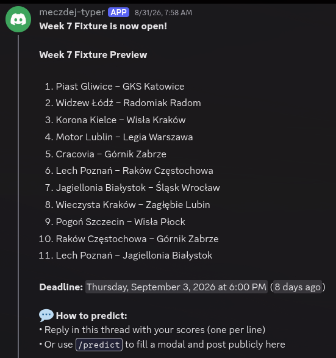

# TyperBot

Discord bot for football prediction leagues. One hosted TyperBot application can be invited into multiple Discord servers; each server gets its own isolated league, active season, fixtures, predictions, scoring rules, and standings. Server admins invite and configure the bot — they do not self-host it.

## How it works

Admins create fixture threads from `/admin panel`, and TyperBot posts a fixture preview into the league channel with a deadline. Players predict either by replying in the thread — one line per match, like `Team A - Team B 2:1` — or with `/predict`, which fills a modal and posts the result publicly into the selected thread. Partial predictions are allowed if each line names its game; missing games count as no prediction, and late partial predictions wait for admin approval.

When the admin enters results and runs score calculation, TyperBot scores every prediction against the season's rules, posts results and updated standings (splitting oversized posts across messages), backs up the SQLite database, and locks the scoring rules for that season. All league data lives in SQLite; backups run after each successful calculation.

## Commands

| Command | Who | Purpose |
| --- | --- | --- |
| `/admin panel` | Admins | Setup, fixtures, results, scoring rules, seasons. |
| `/predict` | Players | Submit or replace predictions in a fixture thread. |
| `/fixtures` | Players | Show open fixtures. |
| `/mypredictions` | Players | Show your open-fixture predictions. |
| `/standings` | Players | Show active-season standings and latest scored fixture. |

## Seasons and scoring

Each server has one active season. Starting a new season archives the old one and resets scoring rules to defaults: exact score 3, correct outcome 1, wrong outcome 0, late full prediction 0 unless waived. Admins can edit the rules until scores exist in the active season; values must be whole numbers ≥ 0. Standings always reflect the server's active season only.

## Setup

Ask the repo owner for the invite link. After inviting TyperBot (it needs `Send Messages`, `Send Messages in Threads`, `Read Message History`, `Add Reactions`, `Create Public Threads`, and `Use Slash Commands`), run `/admin panel`. First-time setup requires Discord `Administrator` or `Manage Server` permission and stores the admin role and the league channel where fixture announcements, threads, reminders, and public result and standings posts go.

[Development](docs/development.md) covers local setup, manual Discord testing, seeding, and checks.

## License

MIT.